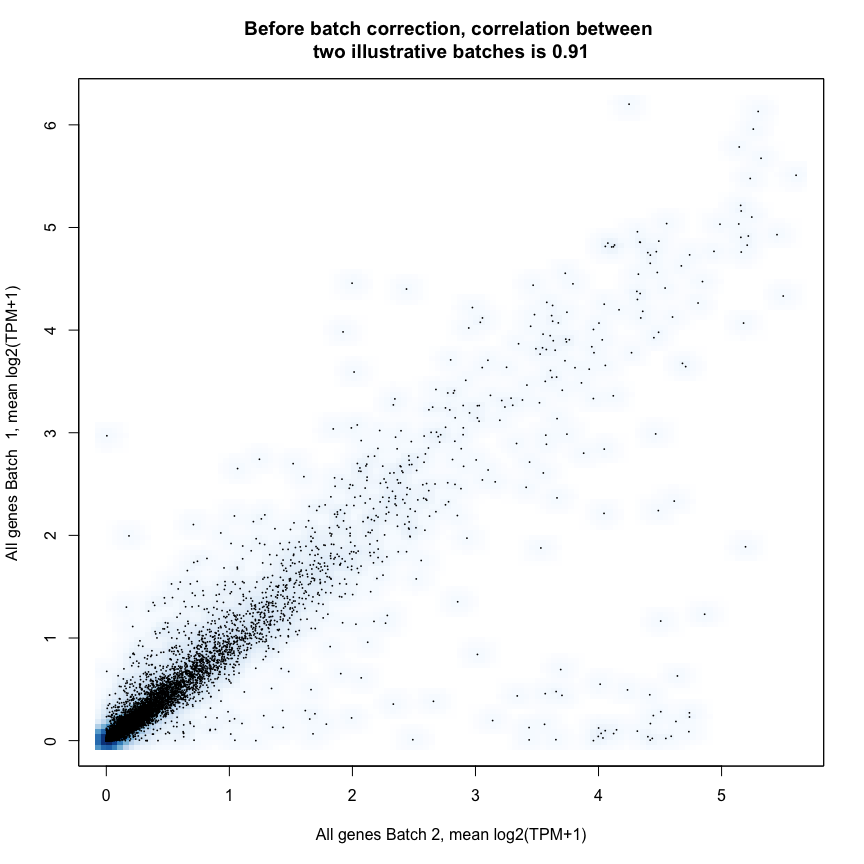
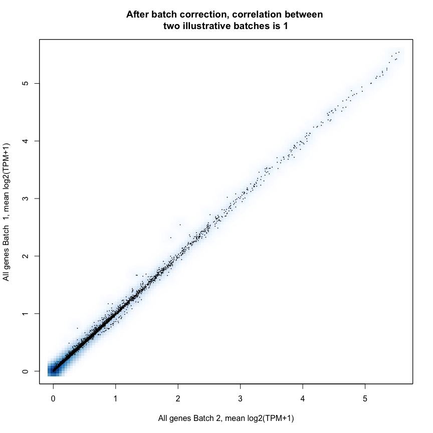
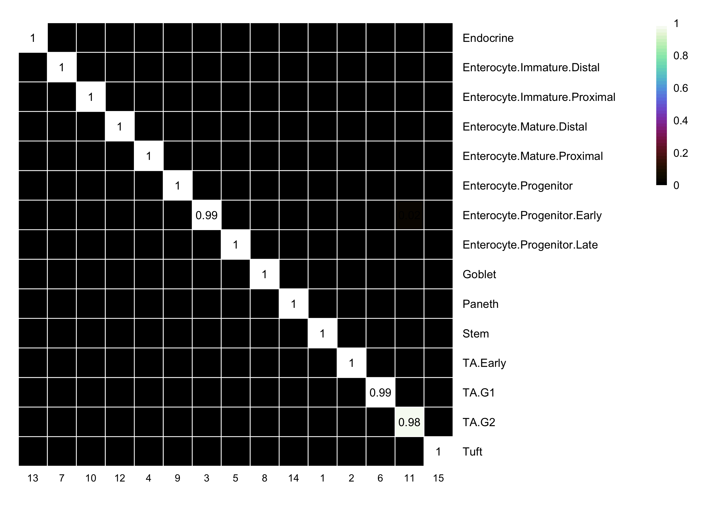
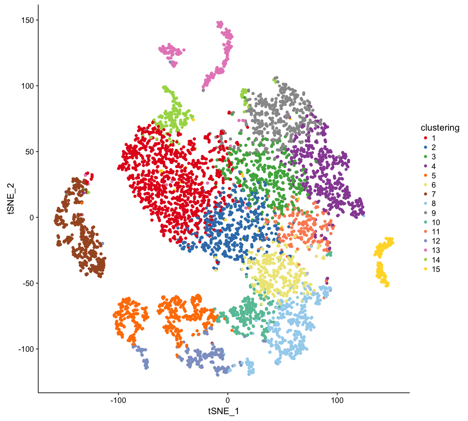

Preprocess the primary droplet-based dataset of normal IECs ('Atlas')
================

### Load UMI count data from GEO

``` r
source("Fxns.R")
## Downloading UMI count data
download.file("ftp://ftp.ncbi.nlm.nih.gov/geo/series/GSE92nnn/GSE92332/suppl/GSE92332_atlas_UMIcounts.txt.gz", destfile="GSE92332_atlas_UMIcounts.txt.gz")
## Reading UMI count data from file
atlas_umis = read.delim("GSE92332_atlas_UMIcounts.txt.gz")
info(sprintf("Data dimensions: %s" , paste(dim(atlas_umis), collapse = "x")))
```

    ## 2017-11-15 20:09:11 INFO: Data dimensions: 15971x7216

### Get variable genes

``` r
v = get.variable.genes(atlas_umis, min.cv2 = 100)
```

    ## 2017-11-15 20:09:15 INFO: Fitting only the 9723 genes with mean expression > 0.0330515521064302


    ## 2017-11-15 20:09:16 INFO: Found 3542 variable genes (p<0.05)

``` r
var.genes = as.character(rownames(v)[v$p.adj<0.05])
```

### Check whether there is a batch effect

``` r
get_field = function(string,field=1,delim="_", fixed=T) return(strsplit(string,delim, fixed=fixed)[[1]][field])
batch.labels = factor(unlist(lapply(colnames(atlas_umis), get_field, 1,"_")))
table(batch.labels)
```

    ## batch.labels
    ##   B1  B10   B2   B3   B4   B5   B6   B7   B8   B9 
    ## 1385  326 1250  840  200  316   75 1258  942  624

``` r
atlas_tpm = data.frame(log2(1+tpm(atlas_umis)))
```

    ## 2017-11-15 20:09:16 INFO: Running TPM normalisation

``` r
## take mean tpm across batches to show batch effect
batch_mean_tpm = group.means(counts = atlas_tpm, groups = batch.labels)
x = batch_mean_tpm[, 1]
y = batch_mean_tpm[,2]
expr.cor = round(cor(x,y),2)
smoothScatter(x, y, nrpoints=Inf, pch=16, cex=0.25, main=sprintf("Before batch correction, correlation between \ntwo illustrative batches is %s", expr.cor), xlab="All genes Batch 2, mean log2(TPM+1)", ylab="All genes Batch  1, mean log2(TPM+1)")
```



### Compensate for batch effect using ComBat

``` r
# Takes a few minutes
atlas_tpm_norm = batch.normalise.comBat(counts = atlas_tpm, batch.groups = batch.labels)
```

    ## Loading required package: mgcv

    ## Loading required package: nlme

    ## This is mgcv 1.8-16. For overview type 'help("mgcv-package")'.

    ## Loading required package: genefilter

    ## Found 10 batches
    ## Adjusting for 0 covariate(s) or covariate level(s)
    ## Standardizing Data across genes
    ## Fitting L/S model and finding priors
    ## Finding parametric adjustments
    ## Adjusting the Data

``` r
batch_mean_tpm_norm = group.means(counts = atlas_tpm_norm, groups = batch.labels)
x = batch_mean_tpm_norm[, 1]
y = batch_mean_tpm_norm[,2]
expr.cor = round(cor(x,y),2)
smoothScatter(x, y, nrpoints=Inf, pch=16, cex=0.25, main=sprintf("After batch correction, correlation between \ntwo illustrative batches is %s", expr.cor), xlab="All genes Batch 2, mean log2(TPM+1)", ylab="All genes Batch  1, mean log2(TPM+1)")
```



### Run (randomized) PCA, t-SNE

``` r
library(rsvd)
pca = rpca(t(atlas_tpm_norm[var.genes,]), center=T, scale=T, retx=T, k=100)$x

# or read PCA rotations used in the paper (since the alg is randomized)
#pca = read.delim(file="atlas_pca_scores.txt")

### run t-SNE
library(Rtsne)
#barnes_hut_tsne = Rtsne(pca[, 1:13], check_duplicates=T,   pca=FALSE, #dont run PCA again
#                               initial_dims = 13, perplexity = 20, max_iter = 100000, verbose=T, whiten=F)
#tsne.rot = barnes_hut_tsne$Y
# or read t-SNE rotations used in the paper (since the alg is randomized)
tsne.rot = read.delim("atlas_tsne.txt")
```

### Test for significant PCs. To avoid very long runtimes, run on a high memory server with lots of cores (n.cores).

    y = sig.pcs.perm(dat=t(atlas_umis[var.genes,]), center=T, scale=T, max.pc=100, B=1000, n.cores=20, randomized=T)
     PC permutation test completed.
     13 PCS significant (p<0.05, 1000 bootstraps)
     Runtime: 5110 s

### Run kNN-graph clustering

``` r
# build cell-cell euclidean distance matrix using significant PC scores
dm = as.matrix(dist(pca[, 1:13]))
# build nearest neighbor graph
knn = build_knn_graph(dm, k = 200)
```

    ## Loading required package: igraph

    ## 
    ## Attaching package: 'igraph'

    ## The following objects are masked from 'package:stats':
    ## 
    ##     decompose, spectrum

    ## The following object is masked from 'package:base':
    ## 
    ##     union

``` r
clustering = cluster_graph(knn)$partition
library(plyr)

# merge a spurious cluster (cluster 16 is only a single cell) into the most similar cluster
clustering = merge_clusters(clustering, c(8, 16))
```

    ## Merging cluster 16 into 8 ..

``` r
## confirm that clusters are extremely similar to those in the paper (infomap is a random-walk based alg, so there are small differences)
clusters_from_paper = factor(unlist(lapply(colnames(atlas_umis), get_field, 3,"_")))
library(NMF)
```

    ## Loading required package: pkgmaker

    ## Loading required package: registry

    ## Loading required package: rngtools

    ## Loading required package: cluster

    ## Warning: replacing previous import 'colorspace::plot' by 'graphics::plot'
    ## when loading 'NMF'

    ## Warning: replacing previous import 'dendextend::cutree' by 'stats::cutree'
    ## when loading 'NMF'

    ## NMF - BioConductor layer [OK] | Shared memory capabilities [NO: bigmemory] | Cores 7/8

    ##   To enable shared memory capabilities, try: install.extras('
    ## NMF
    ## ')

    ## 
    ## Attaching package: 'NMF'

    ## The following objects are masked from 'package:igraph':
    ## 
    ##     algorithm, compare

    ## The following object is masked from 'package:nlme':
    ## 
    ##     coef<-

``` r
aheatmap(as.data.frame.matrix(table(clusters_from_paper, clustering)))
```



### Visualize the clustering overlaid onto the t-SNE (Figure 1b)

``` r
library(ggplot2)
x = data.frame(tsne.rot, clustering)
library(cowplot)
```

    ## 
    ## Attaching package: 'cowplot'

    ## The following object is masked from 'package:ggplot2':
    ## 
    ##     ggsave

``` r
ggplot(x, aes(x=tSNE_1, y=tSNE_2, color=clustering)) + geom_point() + scale_color_manual(values=brewer16)
```


